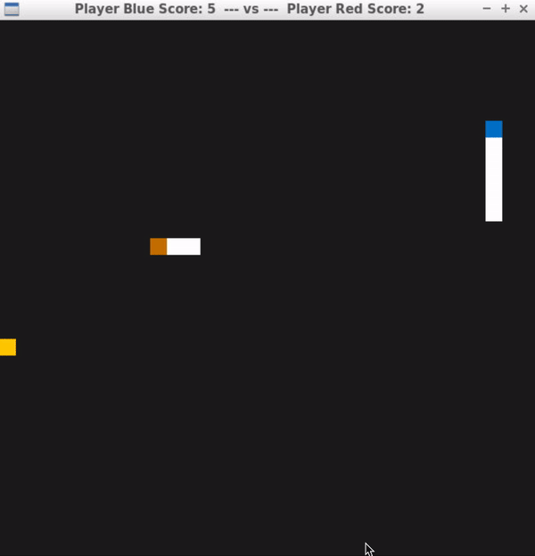

# CPPND: Capstone Snake Game Battle Edition

This is the final Capstone Project in the [Udacity C++ Nanodegree Program](https://www.udacity.com/course/c-plus-plus-nanodegree--nd213).

The project is a battle version for the classic snake game. There are 6 basic rules.
Rule 1: The snake that eats the food will grow in length, increase its score and speed.
Rule 2: The snake can move straight and diagonal.
Rule 2: The snake that has been hit by another snake will lose its body from the crashing point.
Rule 3: The part of body that has been cut will become food for the opponent.
Rule 4: The snake that hits itself loses the game.
Rule 5: The game is over if two snakes hit each other's head. The one with higher score wins the game.
Rule 6: Who gets the 20 score first will win the game.

## Dependencies for Running Locally
* cmake >= 3.7
  * All OSes: [click here for installation instructions](https://cmake.org/install/)
* make >= 4.1 (Linux, Mac), 3.81 (Windows)
  * Linux: make is installed by default on most Linux distros
  * Mac: [install Xcode command line tools to get make](https://developer.apple.com/xcode/features/)
  * Windows: [Click here for installation instructions](http://gnuwin32.sourceforge.net/packages/make.htm)
* SDL2 >= 2.0
  * All installation instructions can be found [here](https://wiki.libsdl.org/Installation)
  * Note that for Linux, an `apt` or `apt-get` installation is preferred to building from source.
* gcc/g++ >= 5.4
  * Linux: gcc / g++ is installed by default on most Linux distros
  * Mac: same deal as make - [install Xcode command line tools](https://developer.apple.com/xcode/features/)
  * Windows: recommend using [MinGW](http://www.mingw.org/)

## Basic Build Instructions

1. Clone this repo.
2. Make a build directory in the top level directory: `mkdir build && cd build`
3. Compile: `cmake .. && make`
4. Run it: `./SnakeGame`.
